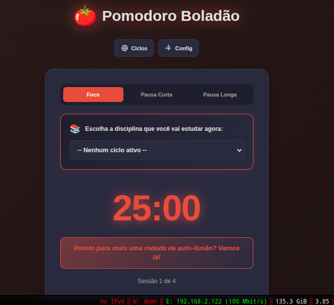
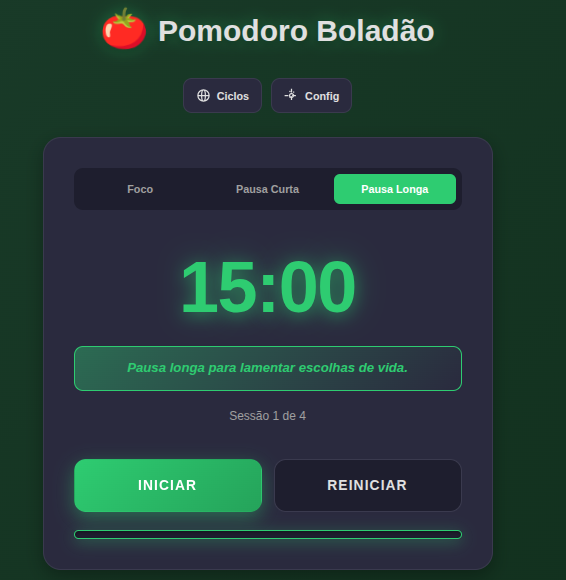

# 🍅 Pomodoro Boladão - Timer com Ciclos de Estudo

## 🖼️ Galeria Pomodoro

<div align="center">
   
   
   
</div>

Sistema completo de Pomodoro Timer integrado com gerenciamento de ciclos de estudos, controle semanal de horas por disciplina e persistência em banco de dados SQLite.

> **✨ Novidades:**  
> ✅ Backend com FastAPI + SQLite  
> ✅ API REST para persistência de dados  
> ✅ Interface dedicada para gerenciamento de ciclos  
> ✅ Sistema de edição de disciplinas  
> ✅ Controle semanal com bloqueio automático  
> ✅ Scripts de inicialização automática (Linux/Mac/Windows)

---

## 🚀 Início Rápido

### 🐧 Linux / 🍎 macOS

```bash
# Clonar o repositório
git clone https://github.com/r0bertgabriel/ciclo-estudo-pomodoro.git
cd ciclo-estudo-pomodoro

# Executar script de inicialização (inicia backend + frontend juntos)
./start-all.sh
```

### 🪟 Windows

```batch
REM Clonar o repositório
git clone https://github.com/r0bertgabriel/ciclo-estudo-pomodoro.git
cd ciclo-estudo-pomodoro

REM Executar script de inicialização (inicia backend + frontend juntos)
start.bat
```

**Pronto! 🎉** A aplicação abrirá automaticamente no navegador em `http://localhost:8080`

---

## 📋 Instalação Detalhada

### 🐧 Linux / 🍎 macOS

#### 1. Instalar Python 3.8+

**Ubuntu/Debian:**
```bash
sudo apt update
sudo apt install python3 python3-pip python3-venv
```

**Fedora/RHEL:**
```bash
sudo dnf install python3 python3-pip
```

**macOS (usando Homebrew):**
```bash
brew install python3
```

#### 2. Verificar instalação
```bash
python3 --version  # Deve mostrar 3.8 ou superior
pip3 --version     # Deve estar instalado
```

#### 3. Clonar e configurar projeto
```bash
git clone https://github.com/r0bertgabriel/ciclo-estudo-pomodoro.git
cd ciclo-estudo-pomodoro

# Instalar dependências do backend
pip3 install -r backend/requirements.txt
```

#### 4. Iniciar aplicação
```bash
# Opção 1: Script automático (recomendado)
./start-all.sh

# Opção 2: Iniciar manualmente
# Terminal 1 - Backend
cd backend
python3 -m uvicorn main:app --reload --port 8000

# Terminal 2 - Frontend
python3 -m http.server 8080
```

---

### 🪟 Windows

#### 1. Instalar Python 3.8+

1. Baixe o instalador em: https://www.python.org/downloads/
2. **IMPORTANTE:** Durante a instalação, marque a opção **"Add Python to PATH"**
3. Clique em "Install Now"

#### 2. Verificar instalação

Abra o **Prompt de Comando** (cmd) ou **PowerShell** e execute:

```batch
python --version
REM ou
python3 --version

pip --version
```

Se aparecer "comando não encontrado", reinicie o computador e tente novamente.

#### 3. Instalar Git (se não tiver)

1. Baixe em: https://git-scm.com/download/win
2. Instale com as opções padrão

#### 4. Clonar e configurar projeto

```batch
REM Abrir Prompt de Comando ou PowerShell
cd Desktop
git clone https://github.com/r0bertgabriel/ciclo-estudo-pomodoro.git
cd ciclo-estudo-pomodoro

REM Instalar dependências do backend
pip install -r backend\requirements.txt
```

#### 5. Iniciar aplicação

**Opção 1: Script automático (recomendado)**
```batch
start.bat
```

**Opção 2: Iniciar manualmente**

Terminal 1 - Backend:
```batch
cd backend
python -m uvicorn main:app --reload --port 8000
```

Terminal 2 - Frontend:
```batch
python -m http.server 8080
```

---

## 📦 Estrutura do Projeto

```
ciclo-estudo-pomodoro/
├── backend/                 # Backend FastAPI
│   ├── __init__.py
│   ├── main.py             # API REST
│   ├── database.py         # Operações SQLite
│   ├── requirements.txt    # Dependências Python
│   └── pomodoro.db        # Banco de dados (criado automaticamente)
├── js/                     # Frontend JavaScript
│   ├── app.js             # Aplicação principal do timer
│   ├── ciclos.js          # Gerenciador de ciclos
│   ├── study-cycle.js     # Lógica de ciclos de estudo
│   ├── storage.js         # Comunicação com API
│   ├── timer.js           # Timer Pomodoro
│   ├── ui.js              # Interface do usuário
│   ├── notifications.js   # Notificações
│   └── config.js          # Configurações
├── index.html             # Página principal (Timer)
├── ciclos.html            # Página de gerenciamento de ciclos
├── styles.css             # Estilos do timer
├── ciclos.css             # Estilos da página de ciclos
├── manifest.json          # PWA manifest
├── sw.js                  # Service Worker
├── start-all.sh           # Script Linux/Mac (inicia tudo)
├── start.bat              # Script Windows (inicia tudo)
└── README.md              # Este arquivo
```

---

## 🎯 Como Usar

### 1. Criar um Ciclo de Estudos

1. Acesse: http://localhost:8080/ciclos.html
2. Clique em **"Novo Ciclo"**
3. Preencha:
   - **Nome do ciclo** (ex: "Concurso SEFA-PA")
   - Selecione os **dias de estudo** da semana
4. Clique em **"Criar Ciclo"**

### 2. Adicionar Disciplinas

1. No ciclo criado, clique em **"Adicionar Disciplina"**
2. Preencha:
   - **Nome da disciplina** (ex: "Português")
   - **Horas semanais** (ex: 5)
   - **Escolha uma cor**
   - **Prioridade** (1 = mais alta)
3. Clique em **"Adicionar"**
4. Repita para todas as disciplinas

### 3. Usar o Timer Pomodoro

1. Acesse: http://localhost:8080/index.html
2. Selecione a disciplina no dropdown
3. Configure os tempos (se desejar):
   - Foco: 25 minutos (padrão)
   - Pausa Curta: 5 minutos
   - Pausa Longa: 15 minutos
4. Clique em **"Iniciar"**
5. Trabalhe até o alarme tocar
6. Faça a pausa quando indicado

### 4. Editar Ciclos e Disciplinas

1. Acesse: http://localhost:8080/ciclos.html
2. Clique em **"Editar Ciclo"** ou no **ícone de editar** da disciplina
3. Modifique os dados
4. Clique em **"Salvar"**

### 5. Excluir Ciclos e Disciplinas

1. Acesse: http://localhost:8080/ciclos.html
2. Clique em **"Excluir Ciclo"** ou no **ícone de lixeira** da disciplina
3. Confirme a exclusão

---

## 🔧 API REST - Endpoints

### Ciclos

- **GET** `/api/cycles` - Lista todos os ciclos
- **POST** `/api/cycles` - Cria um novo ciclo
- **PUT** `/api/cycles/{id}` - Atualiza um ciclo
- **DELETE** `/api/cycles/{id}` - Exclui um ciclo

### Disciplinas

- **GET** `/api/cycles/{cycle_id}/subjects` - Lista disciplinas de um ciclo
- **POST** `/api/cycles/{cycle_id}/subjects` - Adiciona disciplina ao ciclo
- **PUT** `/api/subjects/{id}` - Atualiza uma disciplina
- **DELETE** `/api/subjects/{id}` - Exclui uma disciplina

### Sessões

- **POST** `/api/sessions` - Registra uma sessão de estudo
- **GET** `/api/sessions/subject/{subject_id}` - Sessões de uma disciplina

**Documentação completa:** http://localhost:8000/docs

---

## ⚙️ Configurações

### Tempos do Pomodoro

Edite diretamente na interface (index.html):
- **Foco:** 25 minutos (padrão)
- **Pausa Curta:** 5 minutos (padrão)
- **Pausa Longa:** 15 minutos (padrão)
- **Sessões para pausa longa:** 4 (padrão)

### Porta do Servidor

Para alterar as portas:

**Backend (padrão: 8000):**
```bash
# Linux/Mac
cd backend
python3 -m uvicorn main:app --reload --port 8888

# Windows
cd backend
python -m uvicorn main:app --reload --port 8888
```

**Frontend (padrão: 8080):**
```bash
# Linux/Mac
python3 -m http.server 9090

# Windows
python -m http.server 9090
```

---

## 🐛 Solução de Problemas

### ❌ "Python não é reconhecido como comando"

**Windows:**
1. Reinstale o Python marcando "Add Python to PATH"
2. Ou adicione manualmente: `C:\Users\SEU_USUARIO\AppData\Local\Programs\Python\Python3X`

**Linux/Mac:**
```bash
# Criar alias no .bashrc ou .zshrc
echo 'alias python=python3' >> ~/.bashrc
source ~/.bashrc
```

### ❌ "Erro ao conectar com o backend"

1. Verifique se o backend está rodando: http://localhost:8000/health
2. Veja os logs em `logs/backend.log`
3. Reinstale as dependências:
   ```bash
   pip3 install -r backend/requirements.txt
   ```

### ❌ "Porta 8080 já está em uso"

```bash
# Descobrir processo usando a porta
# Linux/Mac
lsof -i :8080
kill -9 <PID>

# Windows
netstat -ano | findstr :8080
taskkill /PID <PID> /F
```

### ❌ "Disciplinas não aparecem no dropdown"

1. Abra o console do navegador (F12)
2. Verifique se há erros
3. Confirme que o backend está rodando
4. Recarregue a página (Ctrl+R ou Cmd+R)

### ❌ "Erro ao salvar/editar/excluir"

1. Verifique logs: `logs/backend.log`
2. Teste a API: http://localhost:8000/docs
3. Verifique permissões do arquivo `backend/pomodoro.db`

---

## 📊 Funcionalidades

✅ **Timer Pomodoro** com controle de sessões  
✅ **Múltiplos ciclos de estudo** (ex: diferentes concursos)  
✅ **Controle semanal de horas** por disciplina  
✅ **Bloqueio automático** ao atingir meta semanal  
✅ **Priorização de disciplinas**  
✅ **Estatísticas** de tempo estudado  
✅ **Persistência** em banco de dados SQLite  
✅ **API REST** para integração  
✅ **PWA** (funciona offline)  
✅ **Notificações** de desktop  
✅ **Temas visuais** (foco, pausa curta, pausa longa)  
✅ **Edição completa** de ciclos e disciplinas  
✅ **Exclusão** com confirmação

---

## 🛠️ Tecnologias

### Backend
- **Python 3.8+**
- **FastAPI** - Framework web moderno
- **SQLite3** - Banco de dados
- **Uvicorn** - Servidor ASGI

### Frontend
- **HTML5 / CSS3**
- **JavaScript ES6+** (Módulos)
- **Service Worker** (PWA)
- **Fetch API** (Comunicação com backend)

---

## 📝 Licença

MIT License - Sinta-se livre para usar e modificar!

---

## 🤝 Contribuindo

1. Fork o projeto
2. Crie uma branch: `git checkout -b feature/nova-funcionalidade`
3. Commit: `git commit -m 'Adiciona nova funcionalidade'`
4. Push: `git push origin feature/nova-funcionalidade`
5. Abra um Pull Request

---

## 📧 Contato

- GitHub: [@r0bertgabriel](https://github.com/r0bertgabriel)
- Repositório: [ciclo-estudo-pomodoro](https://github.com/r0bertgabriel/ciclo-estudo-pomodoro)

---

## 🎓 Créditos

Desenvolvido com 🍅 para estudantes que querem organizar seus estudos de forma eficiente!

**Técnica Pomodoro:** Francesco Cirillo  
**Aplicação:** r0bertgabriel

---

<div align="center">

### 🍅 **Bons estudos!** 🍅

</div>
